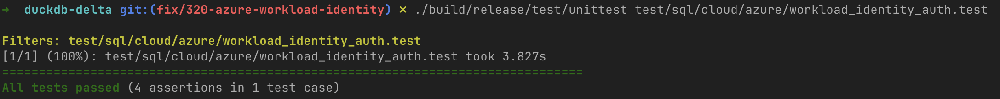

## Intro
This is one of my favorite open source contributions that I've made.
Not because it's the most impressive change or something revolutionary.
It's because I was able to contribute directly to the [DuckDB](https://duckdb.org/) project, which has easily become of my favorite tools as a Data Engineer.

> Still get excited seeing a contributor badge here:


## What is DuckDB?
If you haven't heard of DuckDB before, let me introduce you to one of the most exciting new technologies for those of us in the data analytics space.

DuckDB is a lot of things, but at its core, it's an in-process database designed for analytical use cases. 
It is often described as the SQLite for OLAP scenarios, but it really is so much more.

You can use it to query files directly with SQL and use it as its own query engine.
For example, if I have a local file, I simply query it like this:

```sql
SELECT
    city
    ,count(1)
FROM read_csv("/path/to/some/data.csv")
GROUP BY
    city
```

Plus it comes with a fancy notebook-based CLI that you can use:



Did I also mention that it's crazy fast?

I'm sure I'll post more about how awesome DuckDB is in future posts, but let's get to the actual change that was implemented!

## Background
In my current role, I have been designing and implementing a more modern data platform for our Data Engineering and Data Science teams.
The core of this new architecture is using [Azure Kubernetes Service (AKS)](https://azure.microsoft.com/en-us/products/kubernetes-service) with [Dagster (OSS, self-hosted)](https://dagster.io/platform-overview/data-orchestration) orchestrating all of our pipelines.

By the way, we're using the `AKS Automatic` variant so that we don't have to manage node pools, and it's been a fantastic experience.

Using AKS means that the compute for our pipeline jobs spins up what it needs, when it needs it, and then spins it back down.
Authenticating to our data lake is critical to ensure that we have secure access with the right scope of privileges.
Basically, we need to be able to read and write to our data lake securely.

The modern best-practice is to use a workload identity instead of some password or secret based credential.

### Workload Identity in AKS
Azure provides the ability to define workload identities with permissions, and then assign those identities to AKS clusters.
Instead of wiring in secrets with environment variables or manages secrets in KeyVault, all of which would need to be rotated manually, workload identities will manage and provision short-lived tokens automatically for us.

This means that we can have all of our AKS pods, such as our Dagster pipeline runs, using a particular workload identity with just the right access that it needs without having to wire in secrets or worry about rotation.
It leverages [OpenID Connect (OIDC)](https://openid.net/developers/how-connect-works/), and is considered best practice for security.

### DuckDB Auth in Azure
DuckDB implements authentication with Azure with the [Azure extension](https://duckdb.org/docs/lts/core_extensions/azure).
The most convenient way is using the [credential_chain](https://duckdb.org/docs/lts/core_extensions/azure#credential_chain-provider) provider so that Azure can simply run through a chain of methods to authenticate automatically based how you've configured your process.

In our case, since AKS is providing us the workload identity for us on each pod, we can specifically call out the `workload_identity` path for Azure's credentialing method.
DuckDB would then be able to read and write to our data lake with the appropriate permissions without us having to do much else besides a couple lines like this for the connection:

```sql
CREATE SECRET az_wi (
    TYPE AZURE,
    PROVIDER CREDENTIAL_CHAIN,
    CHAIN 'workload_identity',
    ACCOUNT_NAME 'my_storage_account'
);
```

## The Problem
Most of our data lake uses [Delta Lake](https://docs.delta.io/) tables, which is an open table format the enables ACID transactions to our tables and is the default table format for [Spark](https://spark.apache.org/).
To read from those delta tables, DuckDB requires the [Delta Extension](https://duckdb.org/docs/lts/core_extensions/delta), which allows DuckDB to correctly navigate the format and read the metadata layer/delta logs efficiently.

*This* is where we ran into issues.

The Delta Extension for DuckDB was not accessing the workload identity, and we were hitting auth issues which prevented us from reading those delta tables.
However, we *were* able to read parquet files directly with the workload identity.

That gives us a clue that there are different auth paths at play here, so let's dive into the details and how I was able to resolve the issue.

### Test Driven Development
Because we have an actual AKS workload identity that we know has the appropriate permissions, we can build a test on the following assumption:

> Given a workload identity that has access to Azure Data Lake Storage, we should be able to read both parquet and delta tables

Azure's workload identity has three environment variables that are injected into every pod to make it work.

* `AZURE_CLIENT_ID` - This isn't a secret really, just the unique identifier of the application or client for the identity
* `AZURE_TENANT_ID` - This is the unique identifier for your "organization" for Entra ID
* `AZURE_FEDERATED_TOKEN_FILE` - This is a file path on the pod to where the service account token lives. Tokens are valid for 1 hour by default, and the pod will automatically renew them.

I built a local test that I later put into [the PR to resolve the issue](https://github.com/duckdb/duckdb-delta/pull/321), that would just run a count query on both a parquet file a delta table.

```sql
CREATE SECRET az_wi (
    TYPE AZURE,
    PROVIDER CREDENTIAL_CHAIN,
    CHAIN 'workload_identity',
    ACCOUNT_NAME '{AZURE_STORAGE_ACCOUNT}'
)

SELECT count(*) > 0 -- should be true
FROM delta_scan('{AZURE_DELTA_TEST_PATH}')

SELECT count(*) > 0 -- should be true
from parquet_scan('{AZURE_PARQUET_TEST_PATH}')
```

The parquet query worked just fine, but delta didn't, so what's the difference?

### duckdb-azure vs. duckdb-delta
Depending on if we're querying the data lake via `parquet_scan` or `delta_scan`, DuckDB will take two different paths through its extensions.

`parquet_scan` or `read_parquet` will go to the **Azure Extension**.

`delta_scan` has to go through the **Delta Extension**.

The key difference between the two is that the Azure Extension uses the **Azure SDK in C++**, whereas the Delta Extension is based on **delta-kernel-rs** in Rust.
Here is a visual to illustrate this:


graph TD
%% Main DuckDB Engine
subgraph DuckDB_Engine [DuckDB Engine]
    DuckDB[DuckDB Core]
end

%% Extensions Layer
subgraph Extensions [DuckDB Extensions]
    AzureExt[duckdb_azure]
    DeltaExt[duckdb_delta]
end

%% Underlying SDKs/Libraries
subgraph SDKs [Underlying SDKs & Kernels]
    AzSDK[Azure C++ SDK]
    DeltaKernel[delta-kernel-rs]
end

%% Storage Layer
subgraph Storage [Cloud Storage]
    ADLS[Azure Data Lake Storage ADLS]
    Parquet[Parquet File]
    DeltaTable[Delta Table]
end

%% Query 1 Flow: Parquet via Azure Extension
DuckDB --> AzureExt
AzureExt --> AzSDK
AzSDK --> Parquet

%% Query 2 Flow: Delta via Delta Extension
DuckDB --> DeltaExt
DeltaExt --> DeltaKernel
DeltaKernel --> DeltaTable

%% Storage Context
Parquet -.-> ADLS
DeltaTable -.-> ADLS


The reason that the parquet file query *just works* is because it's using that Azure SDK which already has full knowledge of how to handle workload_identity auth in the credential chain.

In fact, the [source code says that non-cli credential chain paths will just "hope for the best"](https://github.com/duckdb/duckdb-delta/blob/v1.4-andium/src/functions/delta_scan/delta_multi_file_list.cpp#L276-L284).
That unfortunately didn't work so well given the workload identity path, because the three required environment variables were not placed into delta-kernel-rs's object_store.

So let's fix that!

## The Solution
Here is [the PR for the fix](https://github.com/duckdb/duckdb-delta/pull/321), and below are the relevant code changes:



All we needed was to grab the environment variables required by the workload identity and pass them through the constructor.
The reviewer of my change also suggested we throw an error if we don't have all of those required variables which was a great suggestion.

I also included my manual test that by default is skipped in their CI/CD processes so that we can verify the fix works manually.
The repo's CI/CD doesn't have federated workload identities, and that seemed unrealistic to coordinate for this PR.

This proved to be useful so that we could test our final changes by doing the following:

1. Grab the actual token file from a working pod (the `AZURE_FEDERATED_TOKEN_FILE`) to my laptop
2. Assign the three required env vars (`AZURE_FEDERATED_TOKEN_FILE`, `AZURE_CLIENT_ID`, `AZURE_TENANT_ID`)
3. Assign two env vars that represent actual locations with at least one row of data in our data lake that we can query (`AZURE_DELTA_TEST_PATH` and `AZURE_PARQUET_TEST_PATH`)
4. Build our changes and run the [test file](https://github.com/duckdb/duckdb-delta/blob/57958e303ceaeeb22bff39985e46e1b059831d8d/test/sql/cloud/azure/workload_identity_auth.test)

That same test when we run it before our changes will fail with the same errors, but it passes after these updates!



## Conclusion
Breaking down a problem into something that a small test can verify makes working on problems like this so much easier.
As my team continues to use DuckDB, having this feature makes it so our authentication path is much more secure.

The beauty in working in open source is that the changes we implement can be leveraged by everyone!
It makes me happy to be able to contribute back and enable this functionality for anyone trying to securely query their Azure data lake for delta tables via DuckDB (and I highly recommend you do if you're not already!)

More to come on the DuckDB front in future posts!
